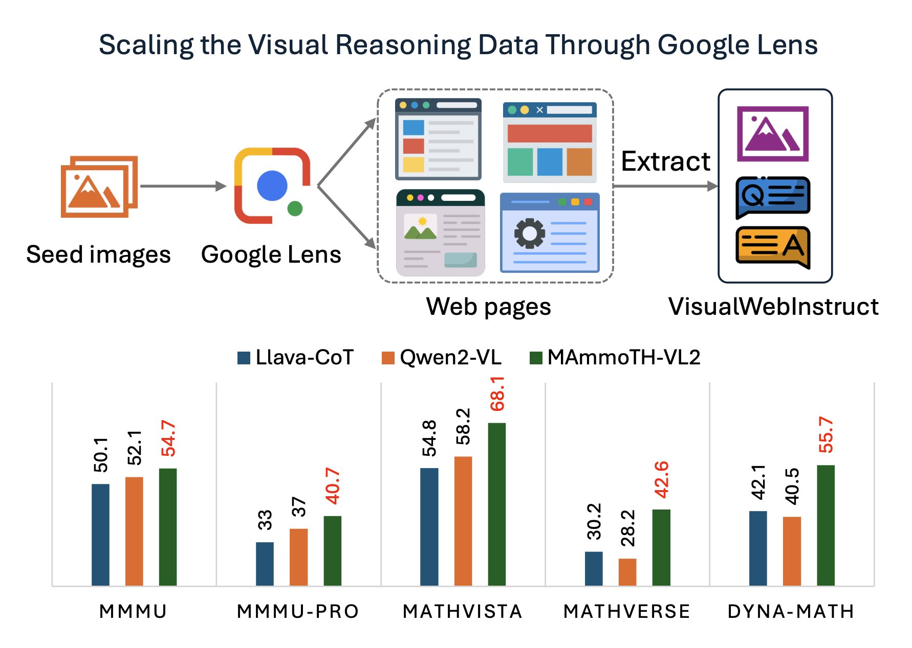

# VisualWebInstruct
The official repo for [VisualWebInstruct: Scaling up Multimodal Instruction Data through Web Search](https://arxiv.org/abs/2503.10582).

<a target="_blank" href="https://arxiv.org/abs/2503.10582">

</a>

<a target="_blank" href="https://huggingface.co/datasets/TIGER-Lab/VisualWebInstruct">

</a>

<a target="_blank" href="https://huggingface.co/TIGER-Lab/MAmmoTH-VL2">

</a>
<br>

## Overview
We utilize Google Search as a tool to augment multimodal reasoning dataset:



## Introduction
Vision-Language Models have made significant progress on many perception-focused tasks, however, their progress on reasoning-focused tasks seem to be limited due to the lack of high-quality and diverse training data. In this work, we aim to address the scarcity issue of reasoning-focused multimodal datasets. We propose VisualWebInstruct - a novel approach that leverages search engine to create a diverse, and high-quality dataset spanning multiple disciplines like math, physics, finance, chemistry, etc. Starting with meticulously selected 30,000 seed images, we employ Google Image search to identify websites containing similar images. We collect and process the HTMLs from over 700K unique URL sources. Through a pipeline of content extraction, filtering and synthesis, we build a dataset of approximately 900K question-answer pairs, with 40% being visual QA pairs and the rest as text QA pairs. Models fine-tuned on VisualWebInstruct demonstrate significant performance gains: (1) training from Llava-OV-mid shows 10-20% absolute point gains across benchmarks, (2) training from MAmmoTH-VL shows 5% absoluate gain. Our best model MAmmoTH-VL2 shows state-of-the-art performance within the 10B parameter class on MMMU-Pro-std (40.7%), MathVerse (42.6%), and DynaMath (55.7%). These remarkable results highlight the effectiveness of our dataset in enhancing VLMs' reasoning capabilities for complex multimodal tasks.

## Repository Structure

The repository is organized into the following directories:

### VisualWebInstruct
Contains the data processing pipeline used to create the dataset:

- **Stage 1: Mining Data from the Internet**
  - Google Image searching
  - Accessibility tree building
  - QA pair extraction
  - Post-processing

- **Stage 2: Dataset Refinement**
  - Answer refinement with consistency checking
  - Answer alignment with original web content

### MAmmoTH-VL
Contains code for model training and evaluation. Since we finetune our model based on MAmmoTH-VL, we use the same codebase:

- **train**: Scripts for pretraining and finetuning
- **evaluation**: Code for evaluating the model on various benchmarks

## Dataset Statistics

Our dataset exhibits the following distribution across knowledge domains:

| Category | Percentage |
|----------|------------|
| Math | 62.50% |
| Physics | 14.50% |
| Finance | 7.25% |
| Chemistry | 4.80% |
| Engineering | 4.35% |
| Others | 6.60% |

The "Others" category includes General Knowledge (2.45%), Computer Science (2.25%), Biology (1.40%), and humanities subjects.

## Model Performance

Models fine-tuned on VisualWebInstruct demonstrate significant performance gains:

1. Training from Llava-OV-mid shows 10-20% absolute point gains across benchmarks
2. Training from MAmmoTH-VL shows 5% absolute gain

Our best model MAmmoTH-VL2 shows state-of-the-art performance within the 10B parameter class on:
- MMMU-Pro-std (40.7%)
- MathVerse (42.6%)
- DynaMath (55.7%)

## Usage

### Dataset Access

The VisualWebInstruct dataset is available on [Hugging Face](https://huggingface.co/datasets/TIGER-Lab/VisualWebInstruct).

### Model Training

To train MAmmoTH-VL2 using our dataset:

```bash
cd MAmmoTH-VL/train
bash LLaVA-NeXT/scripts/train/mammoth_vl/finetune_visualwebinstruct.sh
```

### Evaluation

To evaluate the model:

```bash
cd eval
export HF_HOME=xxx
export HF_TOKEN=xxx
export MLP_WORKER_0_PORT=xxx 
export OPENAI_API_KEY=xxx

CUDA_VISIBLE_DEVICES=0 accelerate launch --num_processes=1 -m lmms_eval --model llava_onevision --model_args pretrained=${MODEL_PATH},conv_template=qwen_2_5,model_name=llava_qwen --tasks mmmu_val --batch_size 1 --log_samples --log_samples_suffix ${TASK_NAME} --output_path xxx
```

Replace `${MODEL_PATH}` with either a locally available model or a model on HuggingFace, and `${TASK_NAME}` with the name of the task you want to evaluate.

## Pretrained Models

Our pretrained models are available on [Hugging Face](https://huggingface.co/TIGER-Lab/MAmmoTH-VL2).

## Acknowledgements

Our implementation builds upon the following codebases:
- [MAmmoTH-VL](https://github.com/MAmmoTH-VL/MAmmoTH-VL)
- [LLaVA-NeXT](https://github.com/LLaVA-VL/LLaVA-NeXT)
- [lmms-eval](https://github.com/EvolvingLMMs-Lab/lmms-eval)

We thank the authors of these repositories for their valuable contributions.

## Citation
```
@article{visualwebinstruct,
    title={VisualWebInstruct: Scaling up Multimodal Instruction Data through Web Search},
    author = {Jia, Yiming and Li, Jiachen and Yue, Xiang and Li, Bo and Nie, Ping and Zou, Kai and Chen, Wenhu},
    journal={arXiv preprint arXiv:2503.10582},
    year={2025}
}
```
